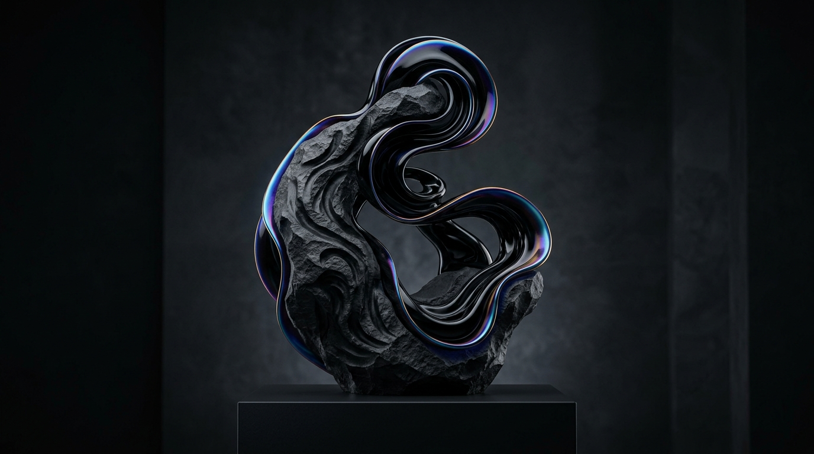
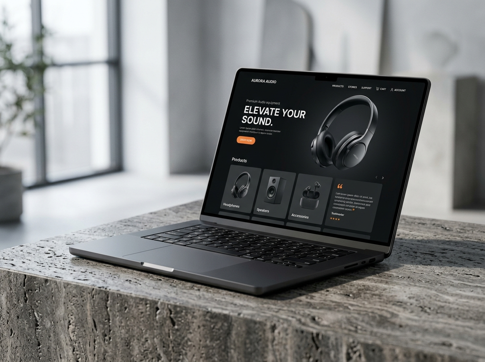
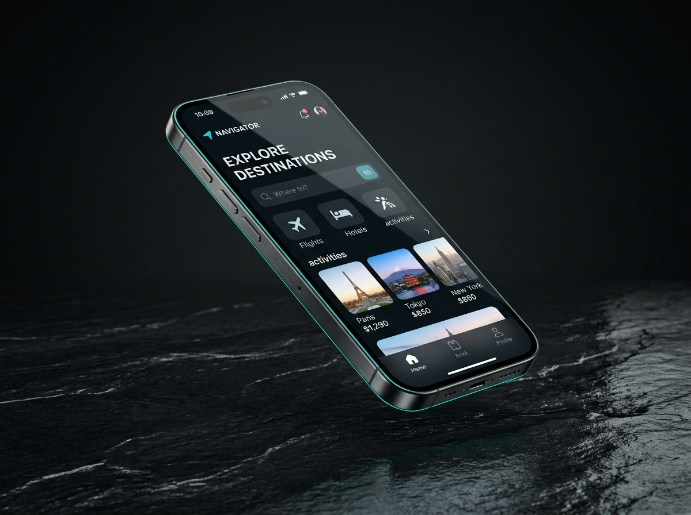
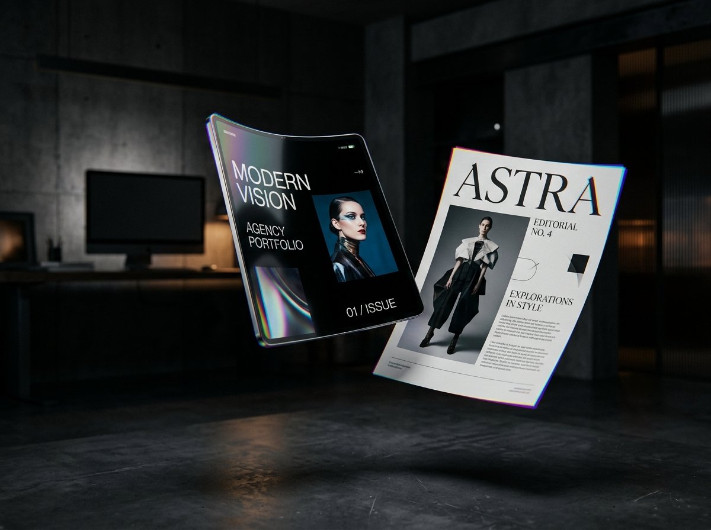
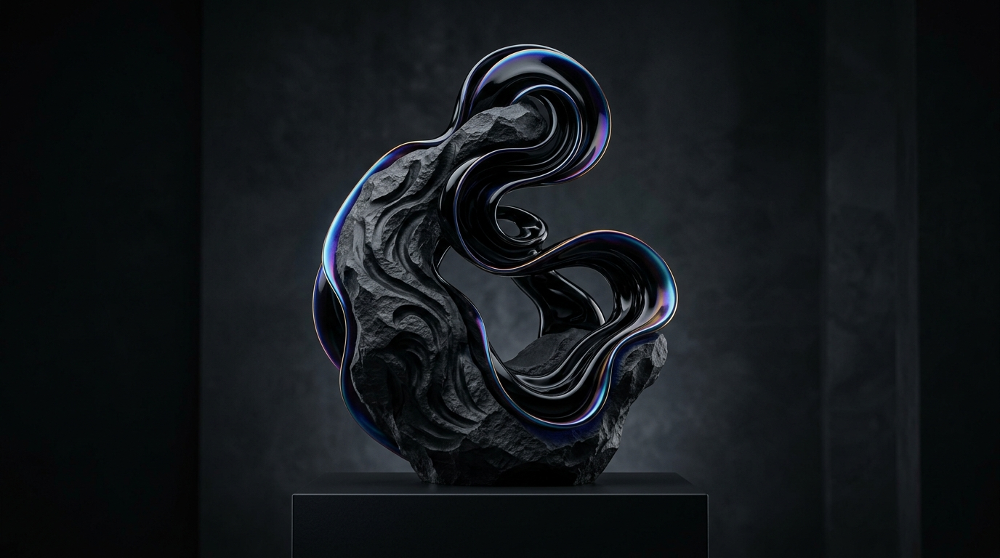

# ByteX Media — Your Growth Our Strategy

<p align="center">
  
</p>

<p align="center">
  <a href="https://bytexmedia.in"></a>
  
  
  
  
</p>

---

## ⚡ Overview

**ByteX Media** is a modern student-led digital agency and engineering studio bridging tier-one software development with accessible pricing for growing Indian businesses.

- **High-Converting Websites** — Starting from **₹2,999** (Sub-second load times, responsive mobile-first architecture, WhatsApp direct integration).
- **Cross-Platform Mobile Apps** — Starting from **₹9,999** (iOS & Android with modern gesture UI, backend database, push notifications).
- **Google Business Profile Dominance** — Complete Setup for **₹999** (Local map pack ranking, NAP consistency audit, review acceleration).
- **Instagram Handling & Content** — Organic follower-to-buyer sales funnels, reels scripts, and visual grid curation.
- **Intelligent AI Automations** — 24/7 WhatsApp auto-reply qualifier, booking bots, and webhook pipelines.

---

## 📸 Visual Showcase & Previews

<table>
  <tr>
    <td width="50%">
      <h4 align="center">Web Engineering Architecture</h4>
      
    </td>
    <td width="50%">
      <h4 align="center">Mobile Native Ecosystem</h4>
      
    </td>
  </tr>
  <tr>
    <td width="50%">
      <h4 align="center">Editorial Brand Presentation</h4>
      
    </td>
    <td width="50%">
      <h4 align="center">Visual 3D Obsidian Flow</h4>
      
    </td>
  </tr>
</table>

---

## 🚀 Commercial Pricing Structure

| Service Tier | Price | Delivery Window | Highlights |
| :--- | :--- | :--- | :--- |
| **Starter Business Website** | **₹2,999** | 3–5 Business Days | 1–3 Responsive Pages, WhatsApp Lead Capture, SEO Meta |
| **Growth Commercial Web** | **₹5,999** | 5–7 Business Days | 5–8 Custom Pages, Dynamic Catalog, Analytics Integration |
| **Mobile App (iOS & Android)** | **₹9,999** | 10–14 Business Days | Cross-platform build, Auth, Cloud DB, Store Readiness |
| **Google Business Profile** | **₹999** | 24–48 Hours | Map Pack Audit, 100% NAP Consistency, Review Tools |
| **Instagram Growth Suite** | **₹3,999/mo** | Ongoing Monthly | Curated Grid, 12 High-Engagement Reels, DM Funnels |

---

## 🛠️ Tech Stack

- **Framework**: React 19 + TypeScript
- **Bundler**: Vite 6
- **Styling**: Tailwind CSS v4 (`@import "tailwindcss";`)
- **Typography**: Syne (Editorial headlines), Space Grotesk (Tech mono accents), Plus Jakarta Sans
- **Icons**: Lucide React
- **Direct WhatsApp Funnel**: Instant pre-filled chat dispatch (`+91 8185807402`)

---

## 💻 Local Development

Clone the repository and install dependencies:

```bash
git clone https://github.com/your-username/bytex-media.git
cd bytex-media
npm install
npm run dev
```

The application will run on `http://localhost:3000`.

### Production Build

```bash
npm run build
npm run preview
```

The compiled output will be ready inside the `dist/` directory with all public preview images copied automatically.

---

## 📞 Direct Contact & Inquiries

- **WhatsApp**: [+91 8185807402](https://wa.me/918185807402)
- **Email**: [hello@bytexmedia.in](mailto:hello@bytexmedia.in)
- **Instagram**: [@bytexmedia](https://instagram.com/bytexmedia)
- **LinkedIn**: [ByteX Media](https://linkedin.com/company/bytex-media)

---

<p align="center">
  <sub>© 2026 ByteX Media. Your Growth Our Strategy. Built with precision and care.</sub>
</p>
